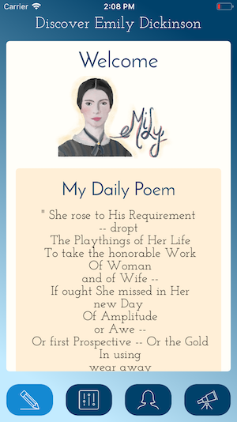

<h1 align="center">Welcome to eMiLy 👋</h1>
<p>
  
  <a href="https://twitter.com/jenlooper">
    
  </a>
</p>



> A mobile app all about Emily Dickinson

## Features

-   Poem of the Day, with 300 poems scraped from the PoetryDB
-   Mood Slider - match a poem's sentiment as determined by Microsoft Cognitive Services (sentiment values are preloaded in the dataset)
-   Selfie Analyzer - match the emotion of your selfie with a poem. Selfie is sent to cognitive services Face API, poems are pre-analyzed
-   New Poetry - poetry generated by textgen-rnn. Pretty strange stuff that still sometimes captures the cadence. New poems have been generated locally and loaded into .json.

## Resources

[The Poetry DB](http://poetrydb.org/index.html) - Lots of poetry here to mine

[Azure Notebooks](https://notebooks.azure.com/jennifer-looper/?WT.mc_id=halfstacknyc-github-jelooper) to test the poetry generator and perform text-mining on Dickinson's poetry

[Text-Gen RNN](https://github.com/minimaxir/textgenrnn) - Train a neural network on texts to generate similar styles

[Microsoft's Face API](https://docs.microsoft.com/en-us/azure/cognitive-services/face/?WT.mc_id=halfstacknyc-github-jelooper) - not creepy at all. Take a selfie, determine emotion, and other uses

[Microsoft Text Sentiment](https://docs.microsoft.com/en-us/azure/cognitive-services/text-analytics/?WT.mc_id=halfstacknyc-github-jelooper) - input some text, output the sentiment. Useful for bots

[Microsoft Cognitive Services](https://docs.microsoft.com/azure/cognitive-services/?WT.mc_id=halfstacknyc-github-jelooper) - lots of interesting pre-trained models to try

[Presentation slides](https://microsoft-cloud-advocates.slides.com/jenlooper/emily)

[Video of a talk about this project](https://halfstackconf.streameventlive.com/embed/53)

## Usage

Make sure you have [NativeScript](https://docs.nativescript.org/angular/start/quick-setup) installed. Clone this app and run `npm i`, then `tns run ios` or `tns run android` to run the app on simulators. You will need a key from Microsoft Cognitive Services; try it free here: https://azure.microsoft.com/en-us/services/cognitive-services/?WT.mc_id=halfstacknyc-github-jelooper.

This app is buit using [NativeScript-Vue](http://www.nativescript-vue.org).

## Author

👤 **Jen Looper**

-   Twitter: [@jenlooper](https://twitter.com/jenlooper)
-   Github: [@jlooper](https://github.com/jlooper)

## Show your support

Give a ⭐️ if this project helped you!

---

_This README was generated with ❤️ by [readme-md-generator](https://github.com/kefranabg/readme-md-generator)_

```

```
